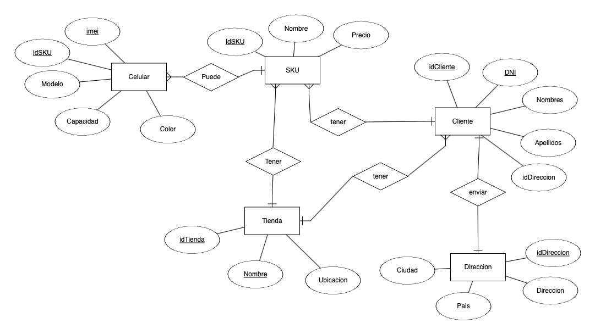
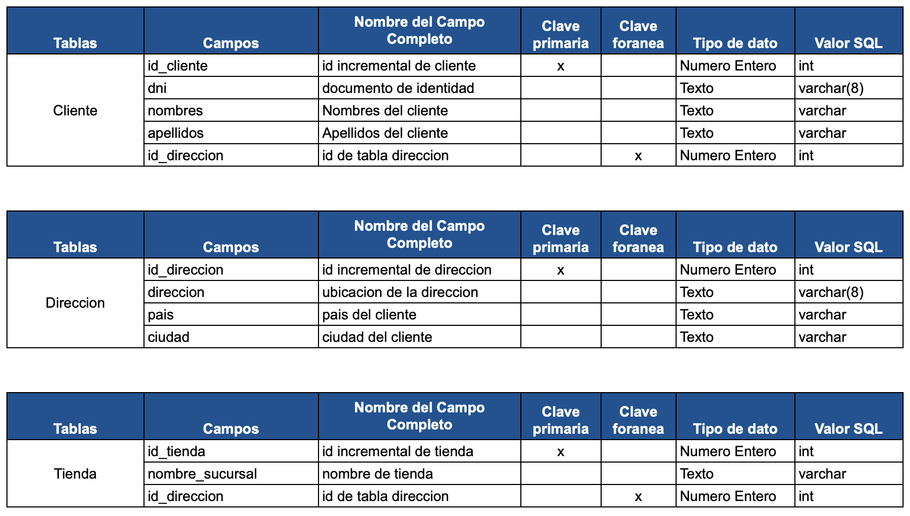

# Proyecto SQL: Creación de Base de Datos para Celulares Apple y Registro de Ventas Apple

Este proyecto se llevará a cabo con el propósito de tener una base de datos capaz de almacenar todos los datos relacionados con la creación de nuevos productos en el catálogo de iPhones.

### Objetivos:

- Consolidar los SKU de celulares en una base de datos accesible para toda la empresa.
- Mantener consistencia en los datos.
- Proporcionar información estandarizada para todas las áreas de la empresa.
- Garantizar la persistencia de los datos en SQL para su almacenamiento, dejando el Excel como una herramienta complementaria.

### Situación Problemática

1 . En Celulares Apple S.A.C., solo el área de Logística tiene acceso a los SKU de los productos; todas las demás áreas deben consultar a Logística para crear códigos nuevos de productos. El proyecto SQL busca democratizar la información en todas las áreas que la requieran.

2 . Aunque la empresa cuenta con sistemas de facturación donde se almacena la información de ventas, esta data solo se puede consultar aproximadamente cada 6 meses. Esto ha llevado al área contable a almacenar sus archivos mensuales mediante tablas de cálculo en Excel mensualmente. La consolidación de los datos se vuelve tediosa, ya que generamos mucha información y se vuelve lenta con Excel. Al guardar toda la información en SQL, se tendrá la información mensual consolidada, y solo se necesitará realizar consultas de los meses o documentos específicos que se requieran.

### Modelo de negocio

La empresa Celulares Apple S.A.C. se encarga de la comercialización de equipos móviles para todo el Perú, con sede en Lima y apoyo de couriers para llegar a todo el país. Debido al creciente consumo de celulares de la marca Apple, surge la necesidad de implementar nuevas tecnologías para la administración de la empresa.

### Diagrama de Entidad Relacion:



### Tablas:




### Script SQL

Creacion de base de datos y tabla de celulares.

```
CREATE SCHEMA IF NOT EXISTS IphoneData;

USE IphoneData;

CREATE TABLE IF NOT exists Direccion (
	id_direccion int not null auto_increment,
    direccion varchar (255) not null,
    pais varchar (255) not null,
    ciudad varchar (255) not null,
    primary key (id_direccion)
);


CREATE TABLE IF NOT exists Clientes (
	id_cliente int not null auto_increment,
    dni varchar (8) not null,
    nombres varchar (255) not null,
    apellidos varchar (255) not null,
    id_direccion int,
    primary key (id_cliente),
    foreign key (id_direccion) references Direccion(id_direccion)
);

CREATE TABLE IF NOT exists Tienda (
	id_tienda int not null auto_increment,
    nombre_sucursal varchar (255) not null,
    id_direccion int,
    primary key (id_tienda),
    foreign key (id_direccion) references Direccion(id_direccion)
);


CREATE TABLE IF NOT exists sku (
	id_sku int not null auto_increment,
    nombre_sku varchar (255) not null,
	modelo varchar (255) not null,
	capacidad varchar (255) not null,
	color varchar (255) not null,
    codigo_sku varchar (255) not null,
    precio float,
    primary key (id_sku)
);

CREATE TABLE IF NOT exists Celulares(

	id_imei int not null auto_increment,
	imei varchar (15) not null,
    id_sku int,
    primary key (id_imei),
    foreign key (id_sku) references sku(id_sku)
);


CREATE TABLE IF NOT exists Ventas(

	id_venta int not null auto_increment,
	serie varchar (4) not null,
    numeracion varchar (3) not null,
    id_tienda int,
    id_cliente int,
    cantidad int,
    id_imei int,
    primary key (id_venta),
    foreign key (id_tienda) references Tienda(id_tienda),
    foreign key (id_cliente) references Clientes(id_cliente),
    foreign key (id_imei) references Celulares(id_imei)
);


```

### Script insert SQL

Creacion de insert sql

```

insert into Direccion(id_direccion,direccion,pais,ciudad)
VALUES
(1,"La direccion en Pueblo Libre","Peru","Pueblo Libre"),
(2,"La direccion en Miraflores","Peru","Miraflores"),
(3,"La direccion en Barranco","Peru","Barranco"),
(4,"La direccion en San Borja","Peru","San Borja"),
(5,"La direccion en Agustino","Peru","Aguatino"),
(6,"La direccion en Lima","Peru","Lima"),
(7,"La direccion en Surco","Peru","Surco"),
(8,"Av. San Martin 123","Peru","Miraflores"),
(9,"Calle Los Pinos 456","Peru","San Isidro"),
(10,"Jr. Huancayo 789","Peru","La Molina"),
(11,"Av. Arequipa 101","Peru","Barranco"),
(12,"Calle Tacna 202","Peru","Jesús María"),
(13,"Jr. Junin 303","Peru","San Borja"),
(14,"Av. Pardo 404","Peru","Jesús María"),
(15,"Calle Lima 505","Peru","Magdalena"),
(16,"Av. Larco 606","Peru","San Miguel"),
(17,"Jr. Cusco 707","Peru","Pueblo Libre"),
(18,"Calle Huaraz 808","Peru","San Miguel"),
(19,"Av. Ayacucho 909","Peru","Chorrillos"),
(20,"Jr. Callao 1010","Peru","Breña"),
(21,"Calle Iquitos 1111","Peru","La Victoria"),
(22,"Av. Huancavelica 1212","Peru","Jesús María"),
(23,"Jr. Ucayali 1313","Peru","Breña"),
(24,"Calle Piura 1414","Peru","Surquillo"),
(25,"Av. Lambayeque 1515","Peru","San Juan de Lurigancho"),
(26,"Jr. Tumbes 1616","Peru","Surquillo"),
(27,"Calle Amazonas 1717","Peru","San Miguel");


insert into Clientes(id_cliente, dni, nombres,apellidos,id_direccion)
values
(1,66453513,"Pedro","Linares",2),
(2,28910873,"Luis","De Carpio",3),
(3,83819755,"Miguel","Salas",1),
(4,97308736,"Brigitte","Colsa",4),
(5,15490415,"Katia","Perez",5),
(6,62083640,"Valentina","Martínez",8),
(7,63434897,"Mateo","García",9),
(8,22468945,"Isabella","Rodríguez",10),
(9,94287825,"Santiago","López",11),
(10,23789714,"Amelia","Pérez",12),
(11,71683594,"Diego","González",13),
(12,82100391,"Olivia","Ramírez",14),
(13,21647160,"Gabriel","Torres",15),
(14,59232724,"Sofia","Sánchez",16),
(15,15844386,"Alejandro","Castro",17),
(16,15441273,"Camila","Flores",18),
(17,16568585,"Leonardo","Díaz",19),
(18,66909706,"Valeria","Herrera",20),
(19,56739624,"Daniel","Ruiz",21),
(20,80119473,"Natalia","Ortega",22),
(21,74008708,"Lucas","Jiménez",23),
(22,21334829,"Emma","Vargas",24),
(23,20920037,"Adrian","Reyes",25),
(24,76053132,"Mia","Mendoza",26),
(25,88453745,"Andres","Medina",27);


insert into Tienda(id_tienda,nombre_sucursal,id_direccion)
values
(1,"Tienda Lima",6),
(2,"Tienda Surco",7);


insert into sku(id_sku, nombre_sku,modelo,capacidad,color, codigo_sku,precio)
values

(1,"iPhone Xr 128 Rojo","iPhone Xr",128,"Rojo","XR128ROJ",999),
(2,"iPhone SE 2020 64 Negro","iPhone SE 2020",64,"Negro","SE264NEG",499),
(3,"iPhone Xs 256 Dorado","iPhone Xs",256,"Dorado","XS256DOR",1300),
(4,"iPhone 11 128 Blanco","iPhone 11",128,"Blanco","11128BLA",1800),
(5,"iPhone 11 128 Morado","iPhone 11",128,"Morado","11128MOR",1800);


insert into Celulares(id_imei,imei,id_sku)
values
(1,"899785403717701",2),
(2,"965979360196480",5),
(3,"905133997837684",3),
(4,"562607816352275",1),
(5,"303047736791084",2),
(6,"820363848987001",2),
(7,"338268132978297",2),
(8,"175672153979542",2),
(9,"502908668981736",2),
(10,"271899756817026",4),
(11,"124979657739823",2),
(12,"356560032035739",3),
(13,"291978043337667",3),
(14,"587433572073705",3),
(15,"558115464012495",5),
(16,"286317154258125",4),
(17,"398261857399933",5),
(18,"172722826645041",2),
(19,"588713986918517",4),
(20,"920165107918006",1),
(21,"194147488182941",5),
(22,"376471582028381",5),
(23,"636752107270364",1),
(24,"436208529041474",1),
(25,"160869555071337",1);


insert into Ventas(id_venta,serie,numeracion,id_tienda,id_cliente,cantidad,id_imei)
values
(1,"B001","001",2,1,1,1),
(2,"B001","002",1,2,1,2),
(3,"B001","003",2,3,1,3),
(4,"B001","004",2,4,1,4),
(5,"B001","005",1,5,1,5),
(6,"B001","006",1,6,1,6),
(7,"B001","007",2,7,1,7),
(8,"B001","008",1,8,1,8),
(9,"B001","009",1,9,1,9),
(10,"B001","010",1,10,1,10),
(11,"B001","011",2,11,1,11),
(12,"B001","012",1,12,1,12),
(13,"B001","013",1,13,1,13),
(14,"B001","014",2,14,1,14),
(15,"B001","015",2,15,1,15),
(16,"B001","016",2,16,1,16),
(17,"B001","017",1,17,1,17),
(18,"B001","018",1,18,1,18),
(19,"B001","019",1,19,1,19),
(20,"B001","020",2,20,1,20),
(21,"B001","021",1,21,1,21),
(22,"B001","022",2,22,1,22),
(23,"B001","023",2,23,1,23),
(24,"B001","024",1,24,1,24),
(25,"B001","025",2,25,1,25);

```

### Create View SQL

Creacion de Vistas en SQL:

- detalle_celulares_imei: Vista de detalle de celulares, la componen la tabla celulares y sku. Tiene por objetivo mostrar el detalle de los celulares creados.

- venta_total_sucursal: ventas total por sucursales usa la tabla Ventas y la vista de detalle_celulares_imei para tener los montos de cada venta y asi consolidarla por cada sucursal.

- cantidad_venta_distrito: usa las siguientes tablas Ventas, Clientes y Direccion para asi poder extraer las ventas de cada distrito enviado por delivery.

- detalle_ventas: usa las siguientes tablas ventas, tiendas, cliente y direcciones, tambien la vista detalle_celulares_imei, esta nos informa de la informacion que contiene la venta.

```

create view  detalle_celulares_imei as
select
	c.id_imei,
    c.imei,
    s.codigo_sku,
    s.modelo,
    s.capacidad,
    s.color,
    s.precio
from celulares c
join sku s
	on c.id_sku = s.id_sku;


create view venta_total_sucursal as
select
	t.nombre_sucursal,
    sum(v.cantidad *d.precio) as total
from Ventas v
join detalle_celulares_imei d
	on v.id_imei = d.id_imei
join Tienda t
	on v.id_tienda = t.id_tienda
group by t.nombre_sucursal;


create view cantidad_venta_distrito as
select
	d.ciudad,
    sum(v.cantidad) as cantidadTotal
from Ventas v
join Clientes c
	on v.id_cliente = c.id_cliente
join Direccion d
	on c.id_direccion = d.id_direccion
group by d.ciudad
order by cantidadTotal DESC;


create view detalle_ventas as
select
	v.serie,
    v.numeracion,
    t.nombre_sucursal,
    c.dni,
    c.nombres,
    c.apellidos,
    d.direccion,
    d.ciudad,
	dc.imei,
    dc.codigo_sku,
    dc.modelo,
    v.cantidad,
    dc.precio,
    (v.cantidad * dc.precio) as monto
from Ventas v
join Tienda t
	on v.id_tienda = t.id_tienda
join Clientes c
	on v.id_cliente = c.id_cliente
join Direccion d
	on c.id_direccion = d.id_direccion
join detalle_celulares_imei dc
	on v.id_imei = dc.id_imei;


create view ventas_por_ciudad as
select
	ciudad,
    sum(monto) as total
 from detalle_ventas
 group by ciudad
 order by total desc;
```

### Funciones

Creacion de funciones

- PagoIgv: funtion storage nos permite ver el igv que se tiene que pagar.

- Total: es la suma del monto mas impuestos

```
delimiter %
create function PagoIgv(monto int) returns float
deterministic
begin
	return monto * 0.18;
end%

create function Total(monto int) returns float
deterministic
begin
	return monto * 1.18;
end%

SELECT *, PagoIgv(monto) as igv, Total(monto) as Total  FROM IphoneData.detalle_ventas;
```

### Storage procedure

Creacion de storage procedure

- sp_get_documentos: este procedure, hace que los documentos sean ordenado de numeracion menor a mayor.

- sp_get_ciudad_top: se creo para saber las ventas totales de cada ciudad enviada, como tambien filtrar por todas las ciduades, hacer un top 20. top 10 o el top que el analista desea aplicar.

```
delimiter //
create procedure sp_get_documentos()
begin
	/* store procede para ver detalle de documentos */

	select serie,numeracion from IphoneData.detalle_ventas
    order by numeracion asc;

end//

call sp_get_documentos

create procedure sp_get_ciudad_top(in top int)
begin
	/* store procede para ver consolidado de todas las ventas por ciudad de top, ingresar cero para tener todos los distritos */

    if top = 0 then
		select ciudad,sum(monto) from IphoneData.detalle_ventas
		group by ciudad
		order by sum(monto) desc;
	else
		select ciudad,sum(monto) from IphoneData.detalle_ventas
		group by ciudad
		order by sum(monto) desc
		limit top;
    end if;

end//

call sp_get_ciudad_top(5)

```

### Triggers

Creacion de triggers

- before_control_series: se creo la tabla control_series, para que este trigger pueda enviar informacion de las series emitidas al momento de la venta.

- afert_delete_series: es un trigger que ayuda a llevar un control de las series eliminadas, por anulacion de documentos.

```

create table control_series (
	id int primary key auto_increment,
    serie varchar(4),
    numeracion varchar(10),
    id_cliente varchar(8),
    estado varchar(10) not null default 'emitido',
    dia datetime
);


create trigger before_control_series
before insert on Ventas
for each row
insert control_series (id, serie, numeracion, id_cliente, dia) values(new.id_venta, new.serie, new.numeracion, new.id_cliente, now());

DELIMITER //
create trigger afert_delete_series
after delete on ventas
for each row
begin
	update control_series
    set estado = 'anulado', dia = now()
    where id = OLD.id_venta;
end;
//
DELIMITER ;


-- test

insert into Ventas(id_venta,serie,numeracion,id_tienda,id_cliente,cantidad,id_imei)
values
(29,"B001","029",2,25,3,20);


delete from Ventas
where id_venta = 29;


-- drop trigger before_control_series

```

### Creacion de Usuarios

- usuario logistica, se encarga de leer los datos que se generan al crear facturas para asi pueda hacer su analisis

- usuario factuador, se encarga de insertar lo datos de factuas y necesita todos los permisos menos eliminar ya que la eliminacion deberia ser delegada al administrador.

```
use  Mysql;
select * from mysql.user;

-- usuario solo lectura de tablas
create user 'logistica'@'localhost' identified by '123456';
-- permisos de seleccion solo tabla iphonedata
grant select on IphoneData.* to 'logistica'@'localhost';
-- revisar permisos
show grants for 'logistica'@'localhost';


-- usuario solo lectura de tablas
create user 'facturador'@'localhost' identified by '123456';
-- permisos de seleccion solo tabla iphonedata
grant all on IphoneData.* to 'facturador'@'localhost';
-- revoca permiso de eliminar
revoke delete on IphoneData.* from 'facturador'@'localhost';
-- revisar permisos
show grants for 'facturador'@'localhost';

```

### Informes Generados en Base de Datps

Creacion de Vistas en SQL, para tener los reportes necesarios:

- detalle_celulares_imei: Vista de detalle de celulares, la componen la tabla celulares y sku. Tiene por objetivo mostrar el detalle de los celulares creados.

- venta_total_sucursal: ventas total por sucursales usa la tabla Ventas y la vista de detalle_celulares_imei para tener los montos de cada venta y asi consolidarla por cada sucursal.

- cantidad_venta_distrito: usa las siguientes tablas Ventas, Clientes y Direccion para asi poder extraer las ventas de cada distrito enviado por delivery.

- detalle_ventas: usa las siguientes tablas ventas, tiendas, cliente y direcciones, tambien la vista detalle_celulares_imei, esta nos informa de la informacion que contiene la venta.

```

create view  detalle_celulares_imei as
select
	c.id_imei,
    c.imei,
    s.codigo_sku,
    s.modelo,
    s.capacidad,
    s.color,
    s.precio
from celulares c
join sku s
	on c.id_sku = s.id_sku;


create view venta_total_sucursal as
select
	t.nombre_sucursal,
    sum(v.cantidad *d.precio) as total
from Ventas v
join detalle_celulares_imei d
	on v.id_imei = d.id_imei
join Tienda t
	on v.id_tienda = t.id_tienda
group by t.nombre_sucursal;


create view cantidad_venta_distrito as
select
	d.ciudad,
    sum(v.cantidad) as cantidadTotal
from Ventas v
join Clientes c
	on v.id_cliente = c.id_cliente
join Direccion d
	on c.id_direccion = d.id_direccion
group by d.ciudad
order by cantidadTotal DESC;


create view detalle_ventas as
select
	v.serie,
    v.numeracion,
    t.nombre_sucursal,
    c.dni,
    c.nombres,
    c.apellidos,
    d.direccion,
    d.ciudad,
	dc.imei,
    dc.codigo_sku,
    dc.modelo,
    v.cantidad,
    dc.precio,
    (v.cantidad * dc.precio) as monto
from Ventas v
join Tienda t
	on v.id_tienda = t.id_tienda
join Clientes c
	on v.id_cliente = c.id_cliente
join Direccion d
	on c.id_direccion = d.id_direccion
join detalle_celulares_imei dc
	on v.id_imei = dc.id_imei;


create view ventas_por_ciudad as
select
	ciudad,
    sum(monto) as total
 from detalle_ventas
 group by ciudad
 order by total desc;
```

### Herramientas y Tecnologias

- Excel
- ERDPLUS
- MySQL
- WorkBench
- Git y Github
- CoderSpaces
- Docker, Docker Compose y Docker UI (Generacion de Mysql)

```
# Use root/example as user/password credentials
version: "3.1"

services:
  db:
    platform: linux/x86_64
    image: mysql:8.0.20
    # NOTE: use of "mysql_native_password" is not recommended: https://dev.mysql.com/doc/refman/8.0/en/upgrading-from-previous-series.html#upgrade-caching-sha2-password
    # (this is just an example, not intended to be a production configuration)
    command: --default-authentication-plugin=mysql_native_password
    restart: always
    environment:
      MYSQL_ROOT_PASSWORD: example
      MYSQL_SKIP_NAME_RESOLVE: 0
    ports:
      - 3306:3306
    volumes:
      - ./db:/var/lib/mysql
    networks:
      - my-network

networks:
  my-network:
    driver: bridge

```

### Futuras lineas

En el futuro:

- Creacion tabla traslado de equipos entre los locales y la insercion de los traslados.

- Creacion de tabla de inventarios mensuales para la creacion de un kardex para controla el inventario.
